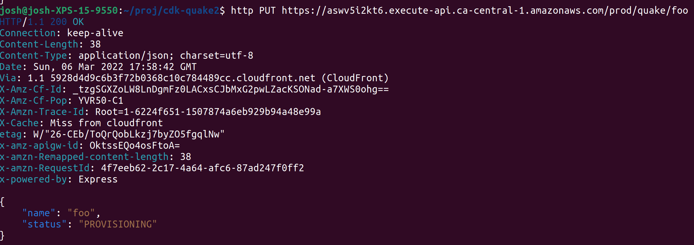
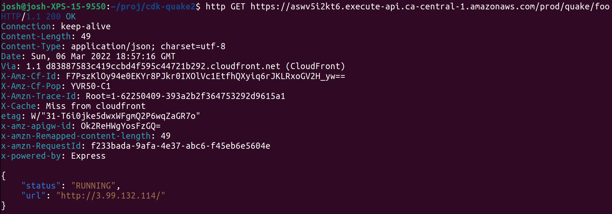
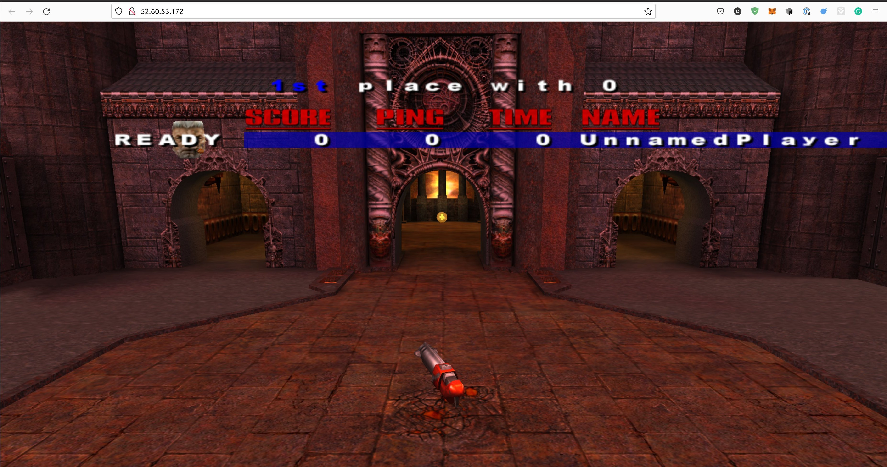
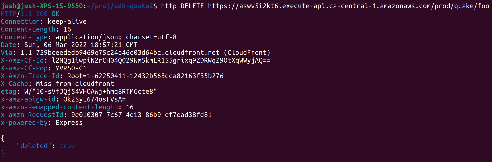

# Quake 3 Multiplayer in a Browser as a Service

A sample CDK app providing an API to spin up Quake 3 servers.

**Outline of services**
- AWS REST API Gateway
- AWS Lambda (TypeScript-based Express server)
- AWS DynamoDB
- AWS ECS
- AWS CRUDL API

## Creating a server

## Getting info once provisioned

## Playing in a browser

## Deleting the server

